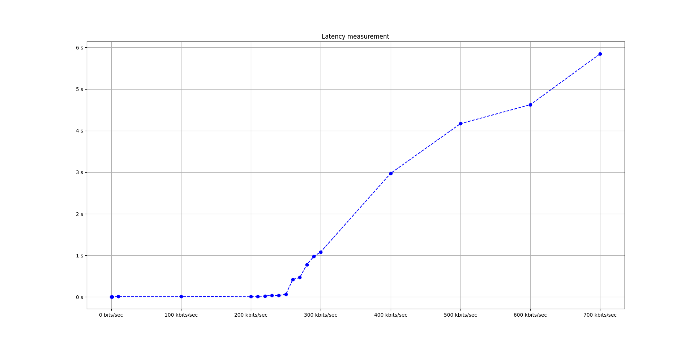

# Performance report

Our system preforms acceptable but is quite sensitive to load.

To test the latency during load we used UDP and limited the bandwidth and observed the
latency at each step.

When working on improving the performance of our system we focused on making sure the
packets could be delivered without being dropped if this meant som more latency. This
proved to be a simple and effective way to optimize the system since NRF24L01 has a
ARQ built in and waiting some nanoseconds more for each 32 byte chunk is much faster
than having to retransmit the whole packet again. The buffer we used also does not
know if a packet is dropped which leads to it being out of sync and will lead to more
drops.

We believe some performance could be gained by utilizing Carrier aggregation but this
will be dependent on the type of data transmitted i.e UDP could see a big improvement
but TCP will not as much.

When addressing other devices within longge we use the NRF24L01 address feature but
also map it to channel. We observed that choosing address which are far apart from
each other will lead to greater performance, probably because of less interference.

We believe that using rust or any other compiled language as we did is of great
importance to performance, especially on "weaker" hardware such as a raspberry pi.
The [nrf24l01](https://docs.rs/nrf24l01/latest/nrf24l01/) crate we used with some
[patches](https://github.com/rtxm/rust-nrf24l01/compare/master...blennster:rust-nrf24l01:master)
have a additional option to use the raspberry pi GPIO registers directly instead
of going through the sysfs kernel module when communicating with the radio using SPI.
According to the author this decreases the latency when writing issuing SPI commands
from ~300ns to ~130ns. The patches also include limiting the address space to
the minimum of 3 bytes instead of 5 which means every packet from the radio
will be 2 bytes shorter and should increase performance.
